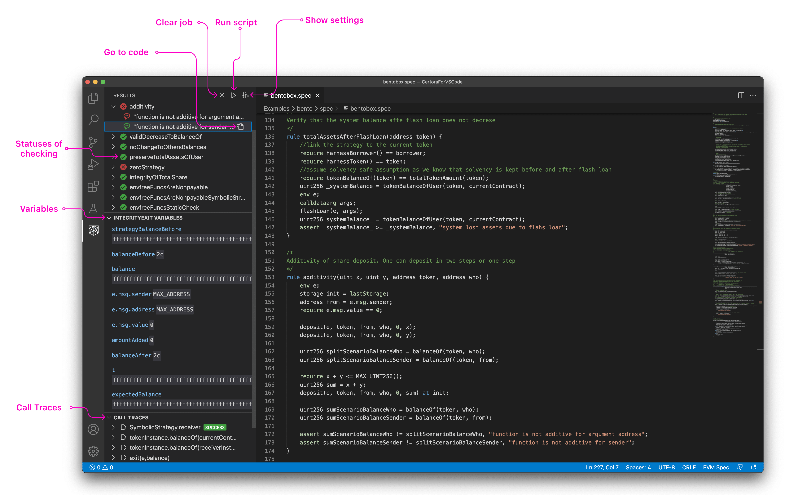
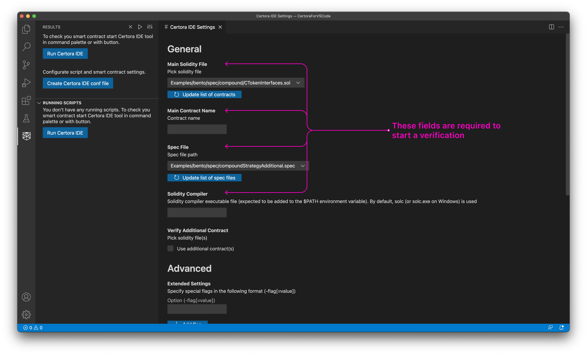
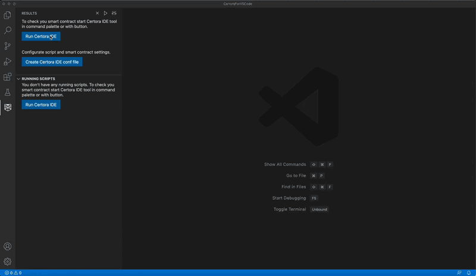

# Certora IDE

The Certora Prover checks at compile-time that all smart contract executions fulfill a set of security rules and interface requirements of other contracts. Certora’s blockchain-independent and language-agnostic Prover technology precisely identifies bugs in Smart Contracts and proves their absence.


Content

- [Features](#features)
- [Prerequisites](#prerequisites)
- [Usage](#usage)
  - [Create a conf file](#create-a-conf-file)
  - [Start a verification](#start-a-verification)
  - [Results](#results)
- [Commands](#commands)
- [Troubleshooting](#troubleshooting)
- [License](#license)

## Features

- Go to Definition
- Call Trace & Variables View
- Check multiple contracts in parallel
- Checking progress status

## Prerequisites

Please follow the Certora Prover [installation instructions](https://certora.atlassian.net/wiki/spaces/CPD/pages/7274497/Installation+of+Certora+Prover).  Please note that steps 1, 2, and 4 are required, while step number 3 is optional but highly recommended.

## Usage

### Create a conf file

When starting the verification, you will be prompted to set the configurations, such as the main contract name, solidity compiler version, and more. These configurations will be stored in a local configuration file in the `conf` subfolder. You can edit the configuration file manually or create a new one (by clicking on the `Create Certora IDE conf file` button). For the list of available options see - [Certora Prover CLI Options](https://certora.atlassian.net/wiki/spaces/CPD/pages/7340043/Certora+Prover+CLI+Options)



### Start a verification

The `conf` file will be used to start the verification process. Use the VS Code Command Palette (`Ctrl/Cmd + Shift + P`) to trigger the `Certora Run Script` command. Alternatively, click the `Run Certora IDE` button.

Note that you can run multiple contracts verification in parallel. A special section shows all ongoing processes, which can be stopped and removed from the list.



### Results

While the verification process advances, you'll see each property (rule or invariant) in the sidebar view. Assert message/s will also be shown when the property reaches a final state(verified/violated/error). Clicking on each of these assertions will reveal all the available information, such as a call trace, variables, and more.


## Commands

The following commands can be accessed via the [Command Palette](https://code.visualstudio.com/docs/getstarted/userinterface#_command-palette):

| command                   | description                                       | availability   |
| ------------------------- | ------------------------------------------------- | -------------- |
| Certora: Run Script       | Choose a conf-file & start verifying              | On Results Tab |
| Certora: Create conf file | Shows the `settings` window                       | Always         |
| Certora: Edit conf file   | Edit conf file in the `settings` window           | Always         |
| Certora: Clear Results    | Clears the results list                           | On Results Tab |

## Troubleshooting

### Freeze

If you experience a frozen state (buttons don't work), you need to use `cmd/ctrl + shift + p` and find the `Developer: Open Webview Developer Tools` command. Go to the `console` in the devtool window, and copy (or make a screenshot of) the logs. Next, press `cmd/ctrl + shift + p` and type `Developer: Reload Window`.

### CERTORAKEY is missing

The following error message - `Couldn't find Certora Key` may indicate that `CERTORAKEY` variable was not defined globally. You can try to fix it at the VS Code level. For doing this, please go to the VS Code setting, `terminal.integrated.env.` and set it as an environment variable:
```
"env": {
    "CERTORAKEY": "place_your_certora_key_here",
}
```

### Logs & Notifications

Every time you start a verification, the extension creates a new log file and stores it in the `certora-logs` subfolder. Notifications will be presented on the verification completion or in case of an error (in such a case, you will get a link to the related log file).

If you have any questions about the tool and how to set it up for your needs, see our FAQ: https://www.certora.com/#FAQ.
You can also contact us by email: [support@certora.com](support@certora.com).


## License

vscode-certora-prover is [MIT licensed](LICENSE).
