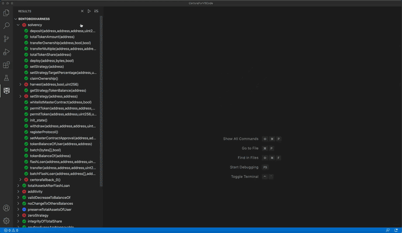

# Certora IDE

The new version of the Certora IDE extension is out!

The Certora Prover checks at compile-time that all smart contract executions fulfill a set of security rules and interface requirements of other contracts. Certora’s blockchain-independent and language-agnostic Prover technology precisely identifies bugs in smart contracts or proves their absence.


Content

- [Features](#features)
- [Prerequisites](#prerequisites)
- [Usage](#usage)
  - [Create a new job](#create-a-new-job)
  - [Start a verification](#start-a-verification)
  - [Results](#results)
  - [Status](#status)
- [Troubleshooting](#troubleshooting)
- [License](#license)

## Extension Features

- Go to definition
- Call trace & variables view
- Check multiple contracts in parallel
- Checking progress status
- Support multiple job runs in parallel
- New and extended settings form

## Prerequisites

Please follow the Certora Prover [installation instructions](https://docs.certora.com/en/latest/docs/user-guide/getting-started/index.html).  Note that steps 1, 2, and 4 are required, while step number 3 is optional but highly recommended.

## Usage

### Create a New Job

When you first open the IDE you will see this starting screen:


To create your first job click either the “Configure New Job” or “Upload Configuration File” buttons.

“Configure New Job” - This option will open an empty new job. Use the settings menu to configure job details.

“Upload Configuration File” - This option will automatically create a new job from the chosen .conf file.


After creating a job, you will see it in the job list and a tab will open with a settings form for the job.

|Description|Location|
|---|---|
|<ol><li>Certora Plugin Settings</li><li>Job List Header Actions<br>   - Run All<br>- Create New Job From Conf File<br>- Create New Job</li><li>Start/Rerun</li><li>Job List Item Actions<br>- Rule Report<br>- Rename<br>- Settings<br>- Delete<br>- Duplicate</li></ol>| |

### Start a Verification

#### Solidity Settings:

|Description|Location|
|---|---|
|<ol><li>Solidity Contracts Settings</li><li>Main Contract Path</li><li>Main Contract Name</li><li>Compiler Executable Name</li><li>Linked Contracts</li><li>Use Multiple Contracts</li></ol>| |

* A red star next to a field name means it is a mandatory field and must be filled to be able to run the job.

* The description inside each setting input box is there to assist you. Please read it carefully as the input required will sometimes be different than the flag value you are used to.

* Some values are filled automatically according to common preferences, but it is best to make sure the value is appropriate for your current requirements.

#### Certora Spec Settings:

|Description|Location|
|---|---|
|<ol><li>Spec Settings</li><li>Spec File Name</li><li>Verify Only Specified Rules<br>(separated by comma)</li></ol>||

#### Message Describing The Job:

|Description|Location|
|---|---|
|<ol><li>Verification Message Settings</li><li>Message Shown on Rule Report</li></ol>||

* The default value for the verification message is the job's name. 

* It is best to keep it short and informative.


### Results

While the verification process advances, you'll see each property (rule or invariant) in the sidebar view. Any assert messages will also be shown when the property reaches a final state (verified/violated/error). Clicking on any of these assertions will reveal all the available information, such as a call trace, variables, and more.



Go to Rule Report from the item in the job list:


## Status

The following image shows possible job status:


* A job cannot run if it is displaying the "Missing Settings" status. 

* A job cannot be edited, renamed, or duplicated if it is displaying either the "Running" or "Pending" statuses.


## Troubleshooting

### Freeze

If you experience a frozen state (e.g. buttons don't work), you need to use `cmd/ctrl + shift + p` and find the `Developer: Open Webview Developer Tools` command. Go to the `console` in the devtool window, and copy (or make a screenshot of) the logs. Next, press `cmd/ctrl + shift + p` and type `Developer: Reload Window`.

### CERTORAKEY is Missing

The following error message - `Couldn't find Certora Key` may indicate that the `CERTORAKEY` variable was not defined globally. You can try to fix it at the VS Code level. In order to do this, please go to Settings in VS Code. In the `Search Settings` input field type `integrated env`, and click `edit in settings.json` based on your OS. Put the `CERTORAKEY` in the opened settings.json file in the following way (replace `linux` with your OS):
```
"terminal.integrated.env.linux": {
    "CERTORAKEY": "place_your_certora_key_here"
}
```

### Logs & Notifications

Every time you start a verification, the extension creates a new log file and stores it in the `certora-logs` subfolder. Notifications will be presented once the verification is complete or if there is an error (in which case you will get a link to the related log file).

If you have any questions about the tool and how to set it up for your needs, please see our FAQ: https://www.certora.com/#FAQ.
You can also contact us by email: [support@certora.com](support@certora.com).


## License

vscode-certora-prover is [MIT licensed](LICENSE).
